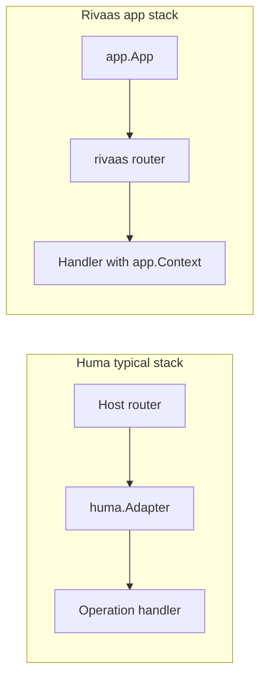

This post compares two Go tools for HTTP APIs: **[Huma](https://huma.rocks/)** and **Rivaas**. Both can produce **OpenAPI** docs from your code. They solve similar problems in different ways.

**Disclosure:** Rivaas is our project. We wrote this comparison to explain real trade-offs, not to claim that one tool always wins. If you already use Chi, Gin, or another router with Huma, your reasons may still be valid after you read this.

## Who this is for

You are choosing a base layer for a Go HTTP API. You care about accurate API docs, validation, and how much wiring you do yourself. You are fine reading a few code snippets.

## What each project is

**Huma** is a small framework built around **OpenAPI 3.1** and **JSON Schema**. You pick a router (for example Chi or Go 1.22 `http.ServeMux`) and wrap it with a Huma **adapter**. You register **operations** with input and output structs. Huma maps requests to those structs, validates with schema rules on struct tags, and serves `/openapi.json`, `/docs`, and related URLs by default. The project targets **incremental adoption**: bring your own router, middleware, and logging or metrics, keep docs aligned with code, and use generated tooling around the same models ([Huma introduction](https://huma.rocks/)). See [Your First API](https://huma.rocks/tutorial/your-first-api/) and [Bring Your Own Router](https://huma.rocks/features/bring-your-own-router).

**Rivaas** is a Go toolkit with a **batteries-included app** (`rivaas.dev/app`) and a **standalone router** (`rivaas.dev/router`). The router uses a **radix tree** (a compact path prefix tree) and a **Bloom filter** for fast route lookups. The app adds **OpenTelemetry** tracing, metrics, and **structured logging**, plus OpenAPI generation, request **binding**, **validation**, health endpoints, graceful shutdown, and TLS options. You can use packages on their own without the full app. See [Rivaas documentation](https://rivaas.dev/docs/).

## Architecture: who owns the server?

Huma stays **router-agnostic**. The host router listens and picks the handler. The Huma **adapter** turns the router’s request into a `huma.Context`, then calls your operation handler. That design helps you add Huma to an existing service without replacing the router.

Rivaas **`app`** owns the HTTP server lifecycle when you call `app.New` and `Start`: timeouts, shutdown, optional health routes, and observability hooks are part of the same layer. **OpenAPI** and **Swagger UI** on Rivaas are wired through **`app`**. If you only need routing speed or `net/http` handlers, you use **`router`** without `app` (no bundled document server on that path).



## Side-by-side technical points

| Topic | Huma | Rivaas |
| ----- | ---- | ------ |
| **Go version** | Follow Huma’s `go.mod` (example tutorials use current Huma v2) | **Go 1.25+** for current Rivaas modules |
| **HTTP base** | Depends on the adapter (stdlib `net/http` for Chi and similar) | **`net/http`** |
| **Router** | You choose (Chi, Gin, Echo, Fiber, `ServeMux`, …) | **Rivaas router** (or you compose at a lower level) |
| **OpenAPI** | **3.1** default; **3.0.3** also available for older tools ([docs](https://huma.rocks/tutorial/your-first-api/)) | **3.0.4** and **3.1.2** via `rivaas.dev/openapi` |
| **Where the spec comes from** | Input/output structs and `huma.Register` / `huma.Get` metadata | **`app.WithDoc`**, `openapi.WithRequest` / `WithResponse`, and your Go types (see **note** below the table). |
| **Validation** | JSON Schema rules on struct tags (`maxLength`, `minimum`, …) | **`app.Context.Bind`** uses **binding** + **validation** (`validate` tags and optional custom rules). OpenAPI **schemas** reuse those tags for rules the **generator** understands, so docs and typical runtime checks stay aligned. |
| **Handler signature** | `func(ctx context.Context, input *Input) (*Output, error)` | `func(c *app.Context)` with `c.Bind`, `c.JSON`, … |
| **Observability** | You bring metrics, tracing, and logging; Huma stays thin | **Built-in** OpenTelemetry-style hooks on `app` (tracing, metrics, `slog`) |
| **Production extras** | You compose (middleware, probes, TLS) | **Health** endpoints, **lifecycle** hooks, **graceful shutdown**, **TLS / mTLS** options on `app` |
| **Signals & shutdown** | You call `http.Server.Shutdown` (often from **`humacli`** `OnStop`; see [Graceful Shutdown](https://huma.rocks/how-to/graceful-shutdown/)) | **`app.Start`** listens for **SIGINT** (Ctrl+C) and **SIGTERM** and runs **graceful shutdown**; optional **SIGHUP** runs **`OnReload`** hooks on Unix ([lifecycle hooks](https://rivaas.dev/docs/reference/packages/app/lifecycle-hooks/)) |
| **Testing** | **`humatest`** builds a test API and helper HTTP calls ([Writing Tests](https://huma.rocks/tutorial/writing-tests/)) | Built-in helpers on **`App`**: **`Test`**, **`TestJSON`**, **`ExpectJSON`**, **`TestContextWithBody`**, **`TestContextWithForm`**, and related APIs in **`testing.go`** (run handlers without starting a TCP server); see [`App.Test`](https://pkg.go.dev/rivaas.dev/app#App.Test). You can still use **`httptest`** and router-level tests. |

**Note (Rivaas — field rules in the OpenAPI document):** The same struct tags you use for binding and validation (`json`, `path`, `query`, `validate`, …) feed field constraints in the spec. You do **not** add a parallel set of tags only for OpenAPI validation. The OpenAPI generator maps **common** rules to JSON Schema; an unusual **`validate`** tag might still run at **runtime** in `Bind` but not show up in the spec until the generator supports it—check the generated JSON for edge cases. Optional **`doc`**, **`example`**, and **`enum`** on fields add descriptions, samples, or allowed values in the spec; they are **not** a second validator.

## OpenAPI and types

Both projects try to keep the spec and the Go types in sync. When you change a field or tag, the generated document should change too.

Huma puts request and response shape in **nested structs** with a `Body` field for JSON bodies. Struct tags carry both JSON names and documentation hints (`example`, `doc`) and schema rules (`maxLength`, `format`, …). That fits JSON Schema as the single source of validation rules.

Rivaas attaches documentation **per route** with `app.WithDoc(...)` and helpers from `rivaas.dev/openapi`. Normal Go types become request and response **schemas**; route-level summaries and descriptions come from **`WithDoc`** and related options, not from duplicating validation. Field-level **constraints** and **documentation** tags follow the note under the comparison table. Swagger UI is configured through OpenAPI options (for example `openapi.WithSwaggerUI`). More detail: [Auto-Generate OpenAPI and Swagger UI in Go with Rivaas](/blog/articles/auto-openapi-swagger-go-rivaas/).

## Binding, validation, and errors

**Huma:** Path, query, header, and body fields are declared on the **input struct**. Invalid input typically returns **422** with a problem payload shaped by Huma’s schema validation (see the [Writing Tests](https://huma.rocks/tutorial/writing-tests/) example with `rating: 10`).

**Rivaas:** Handlers call **`c.Bind(&dst)`** to read the body, path, query, and other sources into one struct. `Bind` runs validation when your types use validation tags or registered rules. Error responses often follow **RFC 9457** (HTTP problem details). Use `Fail`, `FailStatus`, and helpers on `app.Context` together with `rivaas.dev/errors` when you want that shape. Teams that prefer **manual** checks can bind first and then run their own `Validate()` methods, as in the [blog API example](https://github.com/rivaas-dev/rivaas/tree/main/app/examples/02-blog) in the Rivaas repo.

## Observability and production operations

This is the biggest practical gap for many teams.

With **Huma**, you usually plug in OpenTelemetry or Prometheus yourself. Huma does not try to be a full application server; that keeps the core small and fits “we already have opinions on metrics.”

With **Rivaas `app`**, you can turn on tracing, metrics, and logging through **`app.WithObservability`**. Handlers get span and metric helpers on **`app.Context`**. For Kubernetes-style deployments, built-in **liveness** and **readiness** patterns and **graceful shutdown** reduce glue code. Background: [Built-in Observability in Go with Rivaas](/blog/articles/built-in-observability-go-rivaas/).

### Signals and graceful shutdown

**Huma** does not stop the process for you. For a clean exit you call **`http.Server.Shutdown`** (often with a timeout context) when the service should stop. The [Graceful Shutdown](https://huma.rocks/how-to/graceful-shutdown/) guide uses **`humacli`**: `OnStop` runs shutdown while **`ListenAndServe`** runs in `OnStart`. You can do the same with **`signal.NotifyContext`** in `main` if you prefer not to use that CLI. In all cases, connecting **SIGINT** / **SIGTERM** to `Shutdown` is your code.

**Rivaas `app`** builds **signal handling** into **`Start`**. **SIGINT** (Ctrl+C) and **SIGTERM** start **graceful shutdown** without `signal.NotifyContext` in your `main` for the usual case ([`app` server guide](https://rivaas.dev/docs/guides/app/server/)). On **Unix**, if you register **`app.OnReload`** callbacks, **SIGHUP** runs those hooks—useful to **reload config** without exiting. If you register no reload hooks, **SIGHUP** is ignored so the process is not killed by a stray hangup. On **Windows**, **SIGHUP** does not exist; you can call **`Reload()`** from code instead. Details: [Lifecycle hooks](https://rivaas.dev/docs/reference/packages/app/lifecycle-hooks/).

## Performance notes

Rivaas publishes **router** benchmarks and explains how they are measured ([Router performance](https://rivaas.dev/docs/reference/packages/router/performance/)). Huma’s cost is harder to separate from the host router you choose.

In most real APIs, **database and network I/O** matter more than routing time. Use benchmarks to check overhead, not to pick a winner from a single number.

## Small example: same two endpoints

The snippets below are **illustrative**. They are shortened so you can see the shape of each style. You still need the correct `import` blocks (for example `context`, `log`, `net/http`, Chi, and Huma packages on the Huma side).

### Huma (Chi adapter)

Pattern from [Your First API](https://huma.rocks/tutorial/your-first-api/): create `chi.NewMux()`, `humachi.New(router, huma.DefaultConfig(...))`, then register operations. For **201 Created** on POST, the tutorials use `huma.Operation` with `DefaultStatus` ([Writing Tests](https://huma.rocks/tutorial/writing-tests/)).

```go
router := chi.NewMux()
api := humachi.New(router, huma.DefaultConfig("Users API", "1.0.0"))

type UserOut struct {
    Body struct {
        ID    int    `json:"id" example:"1"`
        Email string `json:"email" example:"user@example.com"`
    }
}

huma.Get(api, "/users/{id}", func(ctx context.Context, in *struct {
    ID int `path:"id" minimum:"1" doc:"User id"`
}) (*UserOut, error) {
    out := &UserOut{}
    out.Body.ID = in.ID
    out.Body.Email = "user@example.com"
    return out, nil
})

type CreateUserIn struct {
    Body struct {
        Email string `json:"email" format:"email"`
    }
}

huma.Register(api, huma.Operation{
    Method:        http.MethodPost,
    Path:          "/users",
    Summary:       "Create user",
    DefaultStatus: http.StatusCreated,
}, func(ctx context.Context, in *CreateUserIn) (*UserOut, error) {
    out := &UserOut{}
    out.Body.ID = 42
    out.Body.Email = in.Body.Email
    return out, nil
})

log.Fatal(http.ListenAndServe("127.0.0.1:8888", router))
```

### Rivaas (`app`)

Pattern from [Rivaas README](https://github.com/rivaas-dev/rivaas) and the **02-blog** example: `app.New`, `app.WithOpenAPI`, route registration with `WithDoc`.

```go
a, err := app.New(
    app.WithOpenAPI(
        openapi.WithTitle("users-api", "1.0.0"),
        openapi.WithServer("http://localhost:8080", "local"),
        openapi.WithSwaggerUI("/docs"),
    ),
)
if err != nil {
    log.Fatal(err)
}

type getUserParams struct {
    ID int `path:"id" validate:"gt=0"`
}

a.GET("/users/:id", func(c *app.Context) {
    var p getUserParams
    if err := c.Bind(&p); err != nil {
        c.FailStatus(http.StatusBadRequest, err)
        return
    }
    _ = c.JSON(http.StatusOK, map[string]any{"id": p.ID, "email": "user@example.com"})
}, app.WithDoc(
    openapi.WithSummary("Get user"),
    openapi.WithRequest(getUserParams{}),
    openapi.WithResponse(http.StatusOK, map[string]any{"id": 0, "email": ""}),
))

type createUserBody struct {
    Email string `json:"email" validate:"required,email"`
}

a.POST("/users", func(c *app.Context) {
    var body createUserBody
    if err := c.Bind(&body); err != nil {
        c.FailStatus(http.StatusBadRequest, err)
        return
    }
    _ = c.JSON(http.StatusCreated, map[string]any{"id": 42, "email": body.Email})
}, app.WithDoc(
    openapi.WithSummary("Create user"),
    openapi.WithRequest(createUserBody{}),
    openapi.WithResponse(http.StatusCreated, map[string]any{"id": 0, "email": ""}),
))

if err := a.Start(context.Background()); err != nil {
    log.Fatal(err)
}
```

Imports for the Rivaas snippet are left out for space; you need `context`, `log`, `net/http`, `rivaas.dev/app`, and `rivaas.dev/openapi`.

Default HTTP port for **`app`** is **8080** unless you set `app.WithPort`.

## Choose Huma when…

- You want to keep your **current router** and add OpenAPI, validation, and docs in one step.
- Your team likes **handler functions** that return `(*Output, error)` and a **context.Context** per call.
- You want validation rules to live mainly in **JSON Schema**-style struct tags.
- You prefer to **assemble** tracing and metrics yourself.

## Choose Rivaas when…

- You want **one** `app` type that includes **observability**, **health checks**, **shutdown**, and optional **TLS** with fewer integrations.
- You want a **fast Rivaas router** and `net/http` middleware patterns documented in one place.
- You prefer **RFC 9457** problem details wired through **`app.Context`**, with binding and validation as separate packages you can reuse outside `app`.
- You are starting a **new** service and do not need to keep an existing router API unchanged.

## Further reading

- Huma: [huma.rocks](https://huma.rocks/), [Bring Your Own Router](https://huma.rocks/features/bring-your-own-router), [Test utilities](https://huma.rocks/features/test-utilities/)
- Rivaas: [Documentation](https://rivaas.dev/docs/), [Router performance](https://rivaas.dev/docs/reference/packages/router/performance/)
- On this blog: [Auto-Generate OpenAPI and Swagger UI in Go with Rivaas](/blog/articles/auto-openapi-swagger-go-rivaas/), [Built-in Observability in Go with Rivaas](/blog/articles/built-in-observability-go-rivaas/)
- Broader context: [Go API Frameworks Compared](/blog/comparisons/go-api-frameworks-compared/)
